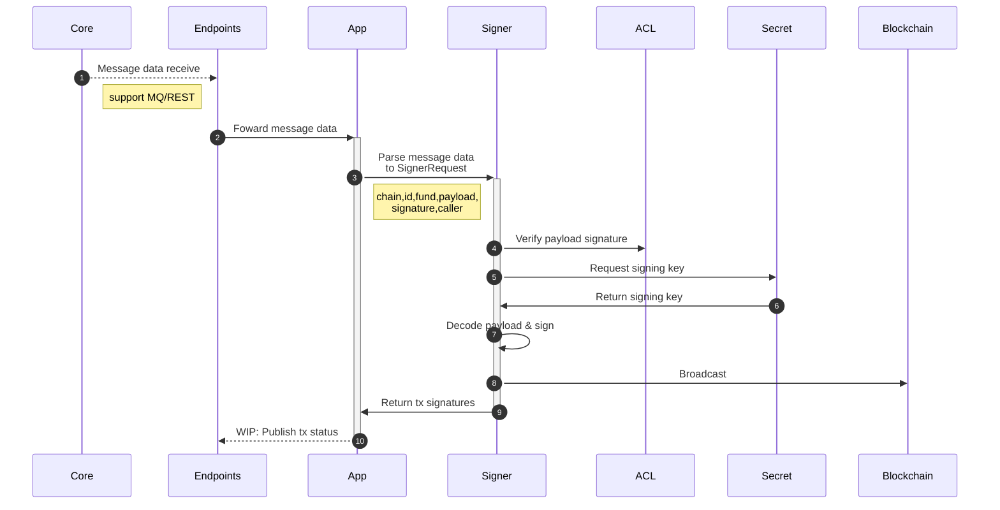

# Avareum Hubble Signer

Avareum fund operation signing modules

See: [Notes](/note.md)

## Example: App signer sequence diagram

```mermaid
sequenceDiagram
    autonumber
    Core-->>Endpoints: Message data receive
    Note left of Endpoints: support MQ/REST
    Endpoints->>+App: Foward message data
    App->>+Signer: Parse message data <br/>to SignerRequest
    Note right of App: chain,id,fund,payload,<br/>signature,caller
    Signer->>ACL: Verify payload signature
    Signer->>Secret: Request signing key
    Secret->>Signer: Return signing key
    Signer->>Signer: Decode payload & sign
    Signer->>Blockchain: Broadcast
    Signer->>-App: Return tx signatures
    App-->>-Endpoints: WIP: Publish tx status
```
