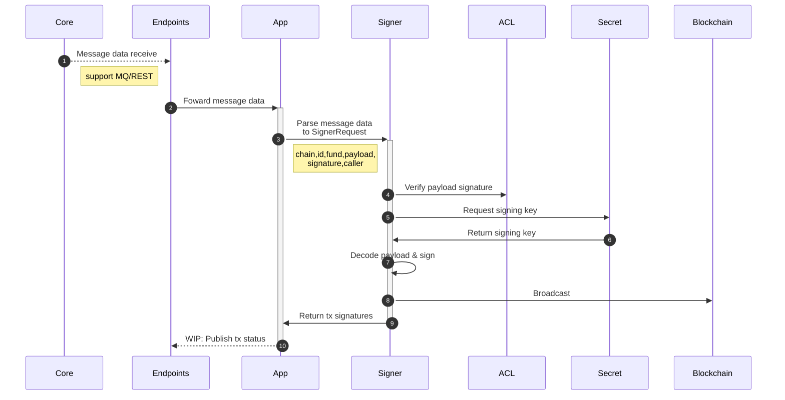

# Avareum Hubble Signer

Avareum fund operation signing modules

See: [Notes](/note.md)

## Run

1. Prepare `GOOGLE_APPLICATION_CREDENTIALS` in `.env`
2. Run using these methods

   2.1. Run using VSCode by `Run and Debug` -> `SignerApp`

   2.2. Run using docker container

```
$ ./make.bash build
$ ./make.bash run
```

3. Access swagger API docs on `http://localhost:8080/swagger/index.html`

## Example: App signer sequence diagram


